

# LTTS Mini Project Report

## 1. Predicting the Survival of Titanic Passengers
The sinking of the Titanic is one of the most infamous shipwrecks in history.

On April 15, 1912, during her maiden voyage, the widely considered “unsinkable” RMS Titanic sank after colliding with an iceberg. Unfortunately, there weren’t enough lifeboats for everyone onboard, resulting in the death of 1502 out of 2224 passengers and crew.

While there was some element of luck involved in surviving, it seems some groups of people were more likely to survive than others.

The task was to predict using Titanic on-board passengers' data that whether a person would be able to survive the accident based on various factors such as his/her age, sex, ticket fare, etc.

### 1.1. Overview of the dataset
  * 891 rows, 12 columns
  * Column description:
    * "PassengerId" - Unique, ranges from 1 to 891
    * "Survived" - whether the passenger survived or not, 0 or 1
    * "Pclass" - class of passenger, 1 or 2 or 3
    * "Name" - Name of the passenger
    * "Sex" - sex of the passenger, male or female
    * "Age" - age of passenger
    * "SibSp" - number of sibling or spouse the passenger had
    * "Parch" - number of parents or children the passenger had
    * "Ticket" - ticket number
    * "Fare" - Fare of the ticket 
    * "Cabin" - Cabin number of the passenger
    * "Embarked" - Place where the passenger embarked from (C = Cherbourg, Q = Queenstown, S = Southampton)

### 1.2. Data Visualization
Visualizing the dataset helps in better understanding of the data in hand and also helps in developing an  intuition on whether a feature would be important in the final prediciton.

#### 1.2.1. How many people survived
  * Unfortunately, majority of the people didn't survive the Titanic accident.

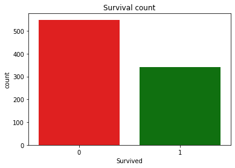

#### 1.2.2. Survival based on "Pclass"
  * Majority of the people from class1 survived.
  * Almost half of people from class2 survived.
  * Majority of the people from class3 did not survive.

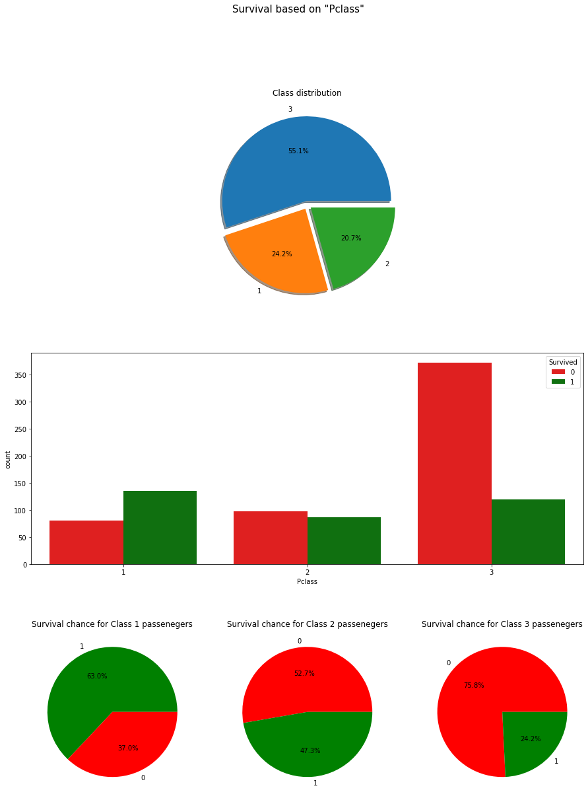

#### 1.2.3. Survival based on "Sex"
  * Lesser proportion of males were able to survive the accident.
  * Greater proportion of females were able to survive the accident.

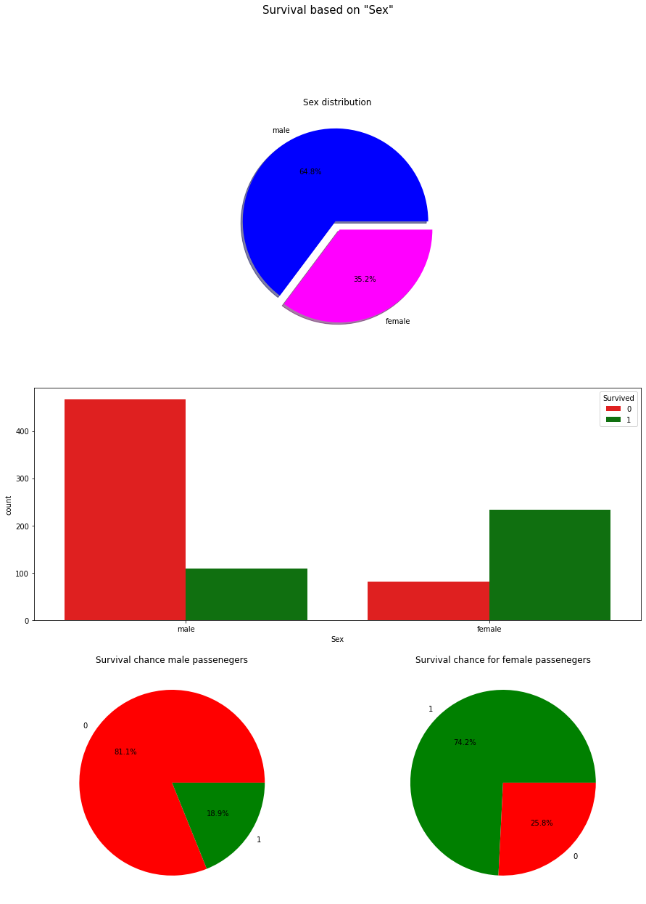

#### 1.2.4. Survival based on "Age"
  * Majority of passengers were between 20-40 years of age.
  * Most of the infants (0-5 year olds) were able to survive.
  * Many young adults (20-30 year olds) were not able to survive.

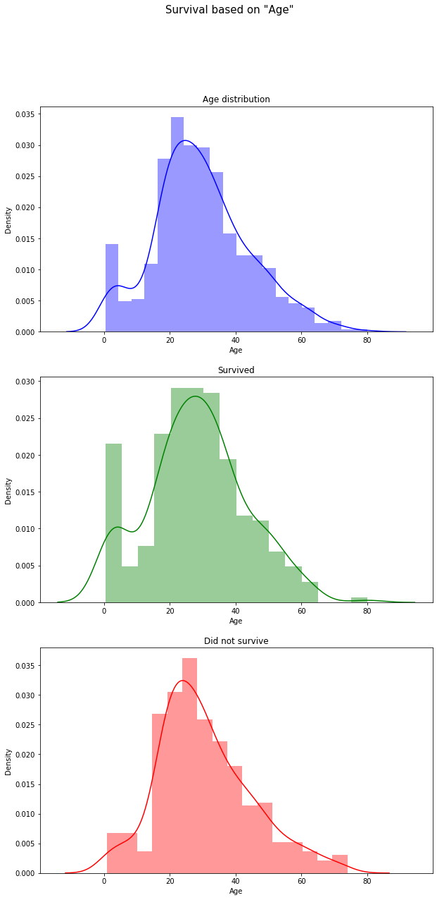

#### 1.2.5. Survival based on "Fare"
  * Most of the passengers were took low-fare tickets.
  * Greater proportion of mid and high-fare ticket passengers were able to survive.
  * Lesser proportion of low-fare ticket passengers were able to survive.

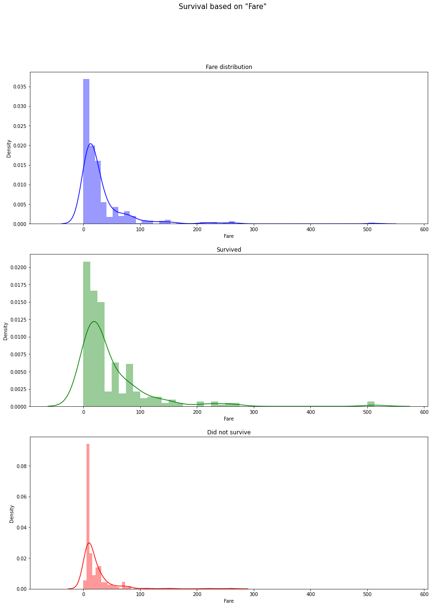

### 1.3. Data Pre-processing
Pre-processing data means removing unwanted attributes from the dataset, filling missing values or removing the tuples with missing values, etc. It overall makes the data useful for the problem or usecase in hand.

#### 1.3.1. Drop columns
  * "Name" - general intuition that survival of a person should not depend on his/her name
  * "Ticket" - general intuition that survival of a person should not depend on his/her ticket number
  * "Cabin" - too many missing values

#### 1.3.2. Filling NaN values
  * Used a distribution plot to have an intuition about skewness of the data to make the decision whether to fill NaN value with mean/median/mode.

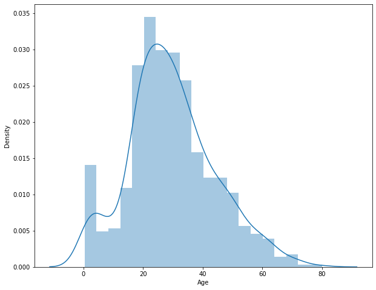

#### 1.3.3. Replacing characters and strings with numerical data
  * Machine learning models operate only in numerical data. Hence it is important to map any string/character type data to some numerical value.

### 1.4. Building the machine learning model
After preparation of the dataset, the final step is to build our machine learning model which is basically an algorithm which takes in our processed data and gives a relevant output based on our use-case.

#### 1.4.1. Reasons to use Random Forest Classifier
  * The problem in hand is a classification problem.
  * RFC makes used of a number of decision trees and combines their result for better and stable predictions.
  * Easier to implement using <i>sklearn</i>.

### 1.5. Submission and assessment score
On submitting the predicted values for the [challenge](https://www.kaggle.com/c/titanic), the following score was achieved.

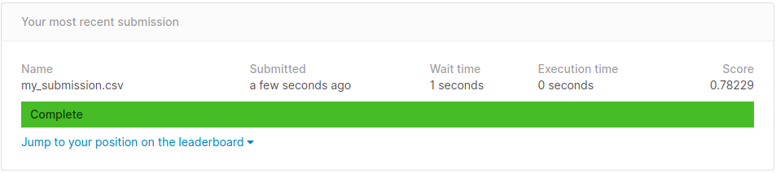

### 1.6. Key learnings
  * Learnt about basics of Random Forest Classifier and decision trees.
  * The concept of bagging in machine learning which says that a combination of ,machine learning models increases the overall result favourably.

 

******
******

 

## 2. Digit Recognizer
MNIST ("Modified National Institute of Standards and Technology") is the de facto “hello world” dataset of computer vision. Since its release in 1999, this classic dataset of handwritten images has served as the basis for benchmarking classification algorithms. As new machine learning techniques emerge, MNIST remains a reliable resource for researchers and learners alike.

The task was to label an input handwritten image using MNIST Handwritten Digits dataset with the correct digit label (0-9) based on learnings from a set of about 42000 sample images.

### 2.1. Overview of the dataset
  * 42000 samples of 28x28 images of handwritten digits.
  * Each column represents pixel value for each of the 784 pixels.
  * One additional column is for the label of the digit that row represents.

### 2.2. Data Visualization
Visualizing the dataset helps in better understanding of the data in hand and also helps in developing an  intuition on whether a feature would be important in the final prediciton.

#### 2.2.1. Visualizing the digits of the dataset
  * Reshaping flattened pixel values into a 28x28 matrix.
  * Plotting the first 5 images along with the digit label as plot title.

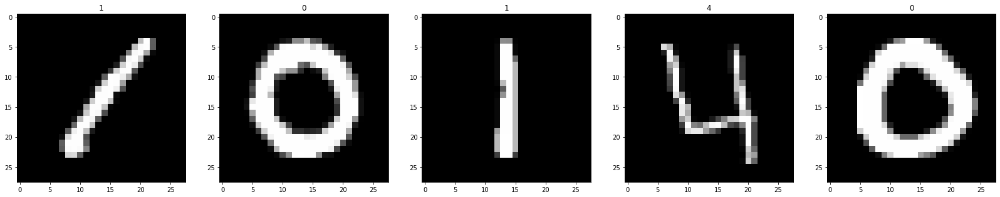

### 2.3. Data Pre-processing
Pre-processing data means removing unwanted attributes from the dataset, filling missing values or removing the tuples with missing values, etc. It overall makes the data useful for the problem or usecase in hand.

#### 2.3.1. Adding color channel before feeding to NN
  * Adding an extra colour channel which will represent grey value.

#### 2.3.2. Feature scaling
  * Standardizing for zero mean and unit std dev.

#### 2.3.3. Converting Y parameter to categorical
  * Output layer of the NN should contain 10 neurons, one for each digit.

### 2.4. Building the machine learning model
After preparation of the dataset, the final step is to build our machine learning model which is basically an algorithm which takes in our processed data and gives a relevant output based on our use-case.

#### 2.4.1. Reasons to use Neural Network
  * The problem in hand is a classification problem.
  * NNs are  ectremely sophisticated to learn patterns and non-linear relationships between inputs and outputs.
  * Easier to implement using <i>sklearn</i>.

#### 2.4.2. Building the NN
  * The input layer takes a 28 x 28 x 1 tensor which is standardized and flattened resulting in a input layer size of 784.
  * The output layer is of size 10, one perceptron for each of the 10 digits.
  * Two hidden layers were also constructed, consisting of 512 and 256 perceptrons respectively.

### 2.5. Submission and assessment score
On submitting the predicted values for the [challenge](https://www.kaggle.com/c/titanic), the following score was achieved.

### 2.6. Key learnings
  * Learnt about basics of neural networks and how they work.
  * Mathematics behind NNs like gradient descent, minimization of cost function, activation functions and their role in deciding the behavious of a perceptron.

### 2.7. Future prospect
Studies show that Convolutional NNs perform better for image based inputs. Hence using a CNN, in theory should further improve the score, however it would require better processing power as well.

 

******
******

 

## 3. Forecast daily electricity prices for hedging
Commercial and industrial users of electricity need to insure themselves against daily price fluctuations of electricity, through hedging. Resource manager of a commercial organization is responsible for managing the hedge contracts. Price forecasts are necessary to develop bidding strategies or negotiation skills in order to maximize benefit from hedge contracts.

The task was to forecast the future electricity prices based on ARIMA model.

### 3.1. Overview of the dataset
  * 3895 rows, 7 columns
  * <i>"TradeDate"</i> and <i>"WtdAvgPrice"</i> are the main columns of interest.

### 3.2. Pre-processing the dataset for time series analysis
A time series shows variation of one or more variable(s) with progreesion in time. This kind of data is highly beneficial for forecasting based application.

#### 3.2.1. Steps involved for pre-processing
  * Checking for null values in *"WtdAvgPrice"*.
  * Checking for duplicates and removing them in *"TradeDate"*.
  * Setting *"TradeDate"* as index variable to convert the dataset to date-time object.

### 3.3. Data Visualization
Visualizing the dataset helps in better understanding of the data in hand and also helps in developing an  intuition on whether a feature would be important in the final prediciton.

#### 3.3.1. Plotting the time series 
  * Following plot shows variation of *"WtdAvgPrice"* with *"TradeDate"*.

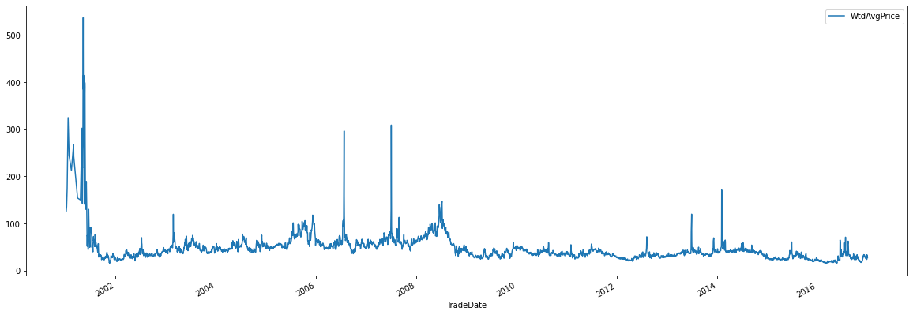

### 3.4. Time series analysis and finding ARIMA parameters (p,d,q)
AutoRegressive Integrated Rolling Avergae (ARIMA) model is based on 3 parameters. The one based on AR (p), one based on MA (q) and one based on stationarity of the time series (d).

#### 3.4.1. Determining d
  * d parameter offsets non-stationary data, i.e. data for which meana and std dev follow a seasonality or trend.
  * For stationary data, d=0.
  * Plotting mean and std dev, and conducting Augmented Dickey Fuller Test may help in determining value of d.

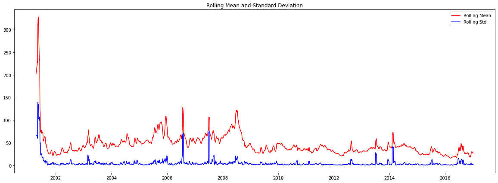

  * Apart from a few spikes, data shows somewhat random mean and constant standard deviation.

ADF Statistic: -11.42623991796312
p-value: 6.684743293232503e-21

  * Since p-value for ADF is smaller than 0.05, hence data is stationary and d=0.

#### 3.4.2. Finding order of MA parameter (q)
  * Plotting autocorrelation to find q.
  * There is considerable spike in first 3 lags, hence q=3.

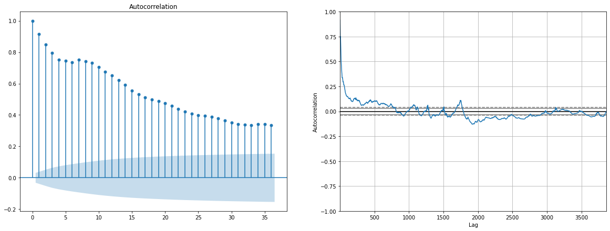

#### 3.4.3. Finding order of AR parameter (p)
  * Plotting partial-autocorrelation to find q.
  * There is considerable spike in first 2 lags, hence p=2.

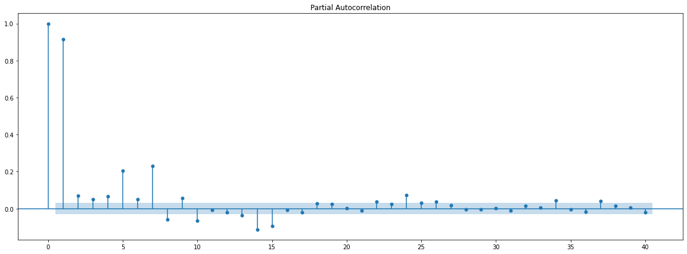

### 3.5. Building and validating ARIMA model
  * The model was framed with (p,d,q) as (2,0,3).
  * Checking for residual to have seasonal or trend behaviour.

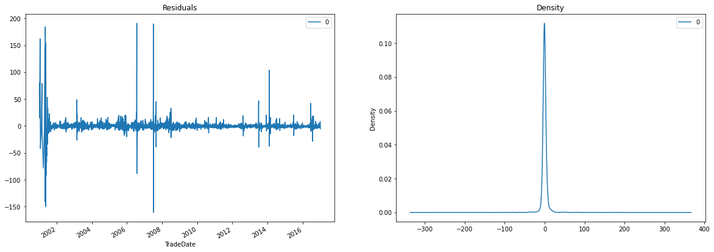

  * Density plot shows near 0 mean and uniform variance, thus, there is no pattern of seasonality or trend in residuals.
  * Validating the model for further correctness using training and testing sets. Here, the value of 'd' parameter had to be changed to 2 due to the values being very far-off from the actual ones.

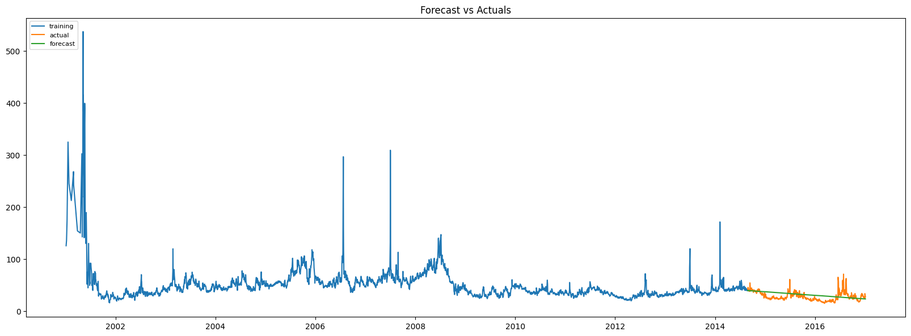

### 3.6. Key learnings
  * Learnt about basics of ARIMA model and how statistical analysis works.
  * Importance of data patterns like seasonality and trend and how they affect the ARIMA model.
  * Augmented Dickey Fuller Test for stationarity.

### 3.7. Future prospect
  * Learning about other types of ARIMA models like Seasonal ARIMA model.
