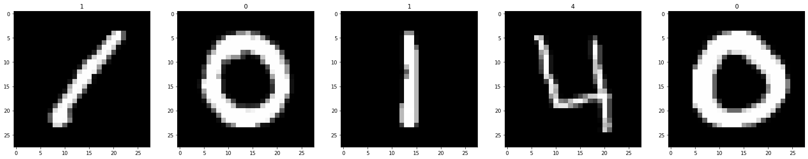

## 2. Digit Recognizer
MNIST ("Modified National Institute of Standards and Technology") is the de facto “hello world” dataset of computer vision. Since its release in 1999, this classic dataset of handwritten images has served as the basis for benchmarking classification algorithms. As new machine learning techniques emerge, MNIST remains a reliable resource for researchers and learners alike.

The task was to label an input handwritten image using MNIST Handwritten Digits dataset with the correct digit label (0-9) based on learnings from a set of about 42000 sample images.

### 2.1. Overview of the dataset
*  42000 samples of 28x28 images of handwritten digits.
*  Each column represents pixel value for each of the 784 pixels.
*  One additional column is for the label of the digit that row represents.

### 2.2. Data Visualization
Visualizing the dataset helps in better understanding of the data in hand and also helps in developing an  intuition on whether a feature would be important in the final prediciton.

#### 2.2.1. Visualizing the digits of the dataset
*  Reshaping flattened pixel values into a 28x28 matrix.
*  Plotting the first 5 images along with the digit label as plot title.

### 2.3. Data Pre-processing
Pre-processing data means removing unwanted attributes from the dataset, filling missing values or removing the tuples with missing values, etc. It overall makes the data useful for the problem or usecase in hand.

#### 2.3.1. Adding color channel before feeding to NN
*  Adding an extra colour channel which will represent grey value.

#### 2.3.2. Feature scaling
*  Standardizing for zero mean and unit std dev.

#### 2.3.3. Converting Y parameter to categorical
*  Output layer of the NN should contain 10 neurons, one for each digit.

### 2.4. Building the machine learning model
After preparation of the dataset, the final step is to build our machine learning model which is basically an algorithm which takes in our processed data and gives a relevant output based on our use-case.

#### 2.4.1. Reasons to use Neural Network
*  The problem in hand is a classification problem.
*  NNs are  ectremely sophisticated to learn patterns and non-linear relationships between inputs and outputs.
*  Easier to implement using <i>sklearn</i>.

#### 2.4.2. Building the NN
*  The input layer takes a 28 x 28 x 1 tensor which is standardized and flattened resulting in a input layersize of 784.
*  The output layer is of size 10, one perceptron for each of the 10 digits.
*  Two hidden layers were also constructed, consisting of 512 and 256 perceptrons respectively.

### 2.5. Submission and assessment score
On submitting the predicted values for the [challenge](https://www.kaggle.com/c/titanic), the following score was achieved.

### 2.6. Key learnings
*  Learnt about basics of neural networks and how they work.
*  Mathematics behind NNs like gradient descent, minimization of cost function, activation functions and their role in deciding the behavious of a perceptron.

### 2.7. Future prospect
Studies show that Convolutional NNs perform better for image based inputs. Hence using a CNN, in theory should further improve the score, however it would require better processing power as well.
