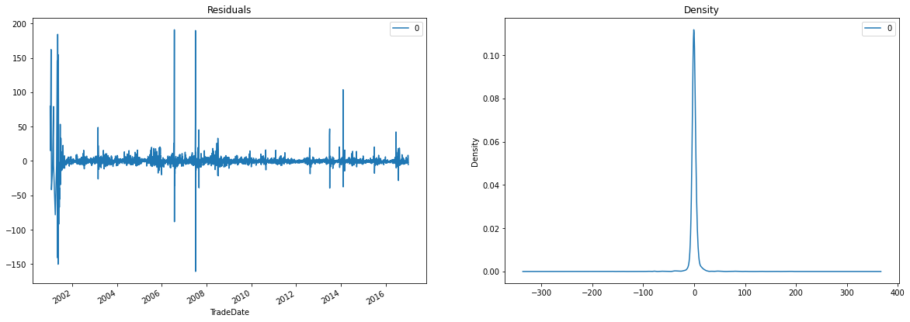

## 3. Forecast daily electricity prices for hedging
Commercial and industrial users of electricity need to insure themselves against daily price fluctuations of electricity, through hedging. Resource manager of a commercial organization is responsible for managing the hedge contracts. Price forecasts are necessary to develop bidding strategies or negotiation skills in order to maximize benefit from hedge contracts.

The task was to forecast the future electricity prices based on ARIMA model.

### 3.1. Overview of the dataset
*  3895 rows, 7 columns
*  <i>"TradeDate"</i> and <i>"WtdAvgPrice"</i> are the main columns of interest.

### 3.2. Pre-processing the dataset for time series analysis
A time series shows variation of one or more variable(s) with progreesion in time. This kind of data is highly beneficial for forecasting based application.

#### 3.2.1. Steps involved for pre-processing
*  Checking for null values in *"WtdAvgPrice"*.
*  Checking for duplicates and removing them in *"TradeDate"*.
*  Setting *"TradeDate"* as index variable to convert the dataset to date-time object.

### 3.3. Data Visualization
Visualizing the dataset helps in better understanding of the data in hand and also helps in developing an  intuition on whether a feature would be important in the final prediciton.

#### 3.3.1. Plotting the time series 
*  Following plot shows variation of *"WtdAvgPrice"* with *"TradeDate"*.

### 3.4. Time series analysis and finding ARIMA parameters (p,d,q)
AutoRegressive Integrated Rolling Avergae (ARIMA) model is based on 3 parameters. The one based on AR (p), one based on MA (q) and one based on stationarity of the time series (d).

#### 3.4.1. Determining d
*  d parameter offsets non-stationary data, i.e. data for which meana and std dev follow a seasonality ortrend.
*  For stationary data, d=0.
*  Plotting mean and std dev, and conducting Augmented Dickey Fuller Test may help in determining value of d.

*  Apart from a few spikes, data shows somewhat random mean and constant standard deviation.

ADF Statistic: -11.42623991796312
p-value: 6.684743293232503e-21

*  Since p-value for ADF is smaller than 0.05, hence data is stationary and d=0.

#### 3.4.2. Finding order of MA parameter (q)
*  Plotting autocorrelation to find q.
*  There is considerable spike in first 3 lags, hence q=3.

#### 3.4.3. Finding order of AR parameter (p)
*  Plotting partial-autocorrelation to find q.
*  There is considerable spike in first 2 lags, hence p=2.

### 3.5. Building and validating ARIMA model
*  The model was framed with (p,d,q) as (2,0,3).
*  Checking for residual to have seasonal or trend behaviour.

*  Density plot shows near 0 mean and uniform variance, thus, there is no pattern of seasonality or trend inresiduals.
*  Validating the model for further correctness using training and testing sets. Here, the value of 'd'parameter had to be changed to 2 due to the values being very far-off from the actual ones.

### 3.6. Key learnings
*  Learnt about basics of ARIMA model and how statistical analysis works.
*  Importance of data patterns like seasonality and trend and how they affect the ARIMA model.
*  Augmented Dickey Fuller Test for stationarity.

### 3.7. Future prospect
*  Learning about other types of ARIMA models like Seasonal ARIMA model.
